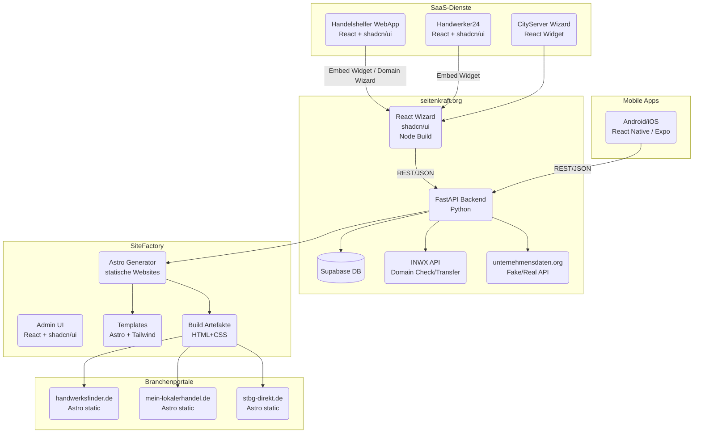

```mermaid
flowchart TD

    subgraph SaaS-Dienste
        HH(Handelshelfer WebApp<br>React + shadcn/ui)
        HW24(Handwerker24<br>React + shadcn/ui)
        CSW(CityServer Wizard<br>React Widget)
    end

    subgraph seitenkraft.org
        SKUI(React Wizard<br>shadcn/ui<br>Node Build)
        SKAPI(FastAPI Backend<br>Python)
        SKDB[(Supabase DB)]
        INWXAPI(INWX API<br>Domain Check/Transfer)
        UDAPI(unternehmensdaten.org<br>Fake/Real API)
    end

    subgraph SiteFactory
        SFUI(Admin UI<br>React + shadcn/ui)
        SFGEN(Astro Generator<br>statische Websites)
        SFTEMPL(Templates<br>Astro + Tailwind)
        SFFILES(Build Artefakte<br>HTML+CSS)
    end

    subgraph Branchenportale
        BP1(handwerksfinder.de<br>Astro static)
        BP2(mein-lokalerhandel.de<br>Astro static)
        BP3(stbg-direkt.de<br>Astro static)
    end

    subgraph Mobile Apps
        RNApp(Android/iOS<br>React Native / Expo)
    end

    %% Verbindungen
    HH -->|Embed Widget / Domain Wizard| SKUI
    HW24 -->|Embed Widget| SKUI
    CSW --> SKUI

    SKUI -->|REST/JSON| SKAPI
    RNApp -->|REST/JSON| SKAPI

    SKAPI --> SKDB
    SKAPI --> INWXAPI
    SKAPI --> UDAPI

    SKAPI --> SFGEN
    SFGEN --> SFTEMPL
    SFGEN --> SFFILES

    SFFILES --> BP1
    SFFILES --> BP2
    SFFILES --> BP3

```